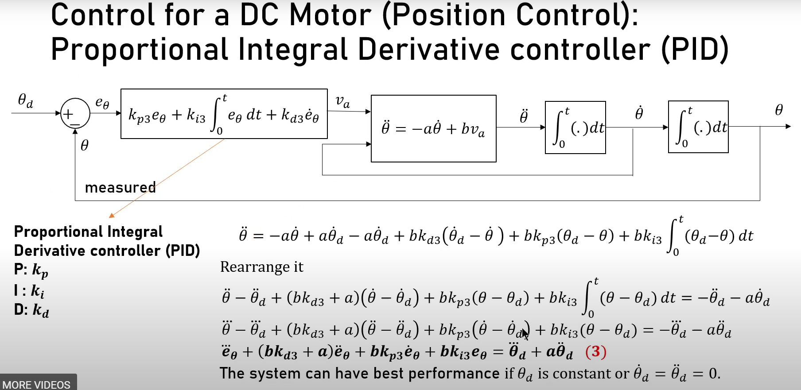

# Control-Theory
### Position control with P (a=30, b=20, zeta=1, wn=2*PI*2)


|Parameters | Value |
|---|---|
|wn1 | ```a*zeta/2```| 
|kp1 | ```wn1^2/2```|


### Position control with PD (a=30, b=20, zeta=1, wn=2*PI*2)

|Parameters | Value |
|---|---|
|kp2 | ```wn^2/b```| 
|kd2 | ```(2*zeta*wn-a)/b``` |

