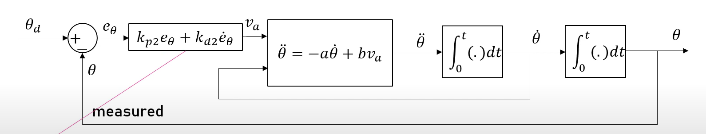
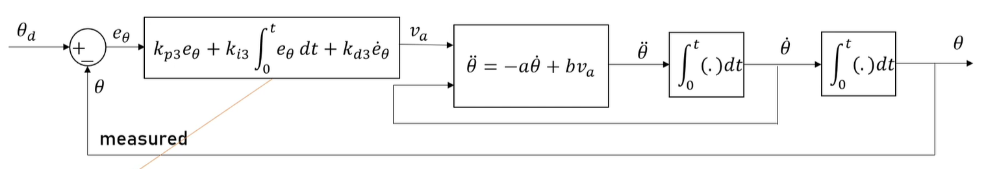

# Control-Theory
### 1. Position control with P Simulation (```a=30, b=20, zeta=1, wn=2*PI*2```)


|Parameters | Value |
|---|---|
|wn1 | ```a*zeta/2```| 
|kp1 | ```wn1^2/2```|


### 2. Position control with PD Simulation (```a=30, b=20, zeta=1, wn=2*PI*2```)

|Parameters | Value |
|---|---|
|kp2 | ```wn^2/b```| 
|kd2 | ```(2*zeta*wn-a)/b``` |

### 3. Position control with PID Simulation (```a=30, b=20, zeta=1, wn=2*PI*2, lamdal=40```)

|Parameters | Value |
|---|---|
|kp3 | ```(wn^2+2*zeta*wn*lambdal)/b```| 
|kd3 | ```(lambdal+2*zeta*wn-a)/b``` |
|ki3 | ```lambdal*wn^2/b``` |

### 4. Position tracking control with PD and feedforward Simulation (```a=30, b=20, zeta=1, wn=2*PI*2```)

|Parameters | Value |
|---|---|
|kp4 | ```wn^2/b```| 
|kd4 | ```(2*zeta*wn-a)/b``` |

### 5. Cascade control with velocity and position feedback inner and outer loop Simulation (```a=30, b=20, zeta=1, wn=2*PI*2```)

|Parameters | Value |
|---|---|
|k1 | ```wn^2/b```| 
|k2 | ```(2*zeta*wn-a)/b``` |


### 6. Position control with PD Hardware Due (```a=30, b=20, zeta=1, wn=2*PI*2```)


|Parameters | Value |
|---|---|
|kp2 | ```wn^2/b```| 
|kd2 | ```(2*zeta*wn-a)/b``` |

- Calculate PWM and direction in Matlab function 
```
function [pwm,dir] = fcn(v_a)

vmax = 22.9;
pwm_cal = v_a*254/vmax;

if pwm_cal > 0
  pwm = pwm_cal;
  dir = 0;
elseif pwm_cal < 0
  pwm = abs(pwm_cal);
  dir = 1;
else
  pwm = 0;
  dir = 0;
end
```
- Read encoder pin with S-fuction 
```
/* Includes_BEGIN */
#ifndef MATLAB_MEX_FILE
#include <Arduino.h>
#include <math.h>
int32_t counter = 0;
uint8_t pinA = 2;
uint8_t pinB = 3;
uint8_t interruptA = 2;
uint8_t interruptB = 3;
      void ai8() {
      // ai8 is activated if DigitalPin nr 9 is going from LOW to HIGH
      // Check pin 9 to determine the direction
      if(digitalRead(pinA) == HIGH){
          if(digitalRead(pinB)==LOW) {
          counter++;
          }else{
          counter--;
          }
      }else{
          if(digitalRead(pinB)==LOW) {
              counter--;
          }else{
              counter++;
          }
      }
      
  }
   
  void ai9() {
  // ai8 is activated if DigitalPin nr 9 is going from LOW to HIGH
  // Check with pin 8 to determine the direction
      if(digitalRead(pinB) == HIGH){
          if(digitalRead(pinA)==LOW) {
              counter--;
          }else{
              counter++;
          }
      }else{
          if(digitalRead(pinA)==LOW) {
              counter++;
          }else{
              counter--;
          }
      }
 
  }
#endif
/* Includes_END */

/* Externs_BEGIN */
/* extern double func(double a); */
/* Externs_END */

void readEncDUEpin8_9_Start_wrapper(real_T *xD)
{
/* Start_BEGIN */
/*
 * Custom Start code goes here.
 */
    #ifndef MATLAB_MEX_FILE
    pinMode(pinA, INPUT_PULLUP); // internal pullup input pin 22 
  
    pinMode(pinB, INPUT_PULLUP); // internal pullup input pin 23
//Setting up interrupt
  //A rising pulse from encodenren activated ai0(). AttachInterrupt 0 is DigitalPin nr 2 on moust Arduino.
    attachInterrupt(interruptA, ai8, CHANGE);
   
  //B rising pulse from encodenren activated ai1(). AttachInterrupt 1 is DigitalPin nr 3 on moust Arduino.
    attachInterrupt(interruptB, ai9, CHANGE);
    
      #endif
/* Start_END */
}

void readEncDUEpin8_9_Outputs_wrapper(int32_T *count,
                                      const real_T *xD)
{
/* Output_BEGIN */
/* This sample sets the output equal to the input
      y0[0] = u0[0]; 
 For complex signals use: y0[0].re = u0[0].re; 
      y0[0].im = u0[0].im;
      y1[0].re = u1[0].re;
      y1[0].im = u1[0].im;
 */

    #ifndef MATLAB_MEX_FILE
    count[0] = counter;
    #endif
/* Output_END */
}

void readEncDUEpin8_9_Update_wrapper(int32_T *count,
                                     real_T *xD)
{
/* Update_BEGIN */
/*
 * Code example
 *   xD[0] = u0[0];
 */
/* Update_END */
}

void readEncDUEpin8_9_Terminate_wrapper(real_T *xD)
{
/* Terminate_BEGIN */
/*
 * Custom Terminate code goes here.
 */
/* Terminate_END */
}
```
- Convert pulse to radian 
```
function outGearBox = fcn(u,ppr,gearRatio)

persistent counter_num over_flag
if(isempty(counter_num)), counter_num = 0;end
if(isempty(over_flag)), over_flag = 0;end
pulse2radian = 2*pi/ppr; % 1 pulse = ?? radian

if(double(u) - counter_num > 40000), over_flag = over_flag-1;
elseif(double(u) - counter_num < -40000), over_flag = over_flag+1;
end

inGearBox = (double(u)+over_flag*(2^32 -1))*pulse2radian; 
outGearBox = inGearBox/gearRatio;
counter_num = double(u) ;
```


